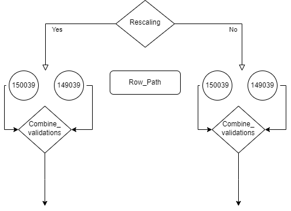

# SEBAL Soil Moisture estimates validation 

This repository contains the code for Validation of SEBAL soil moisture estimates using WIT SMS Network over Central Punjab.

## Installation and Setup
To run the models and scripts in this repository, ensure your system meets the following requirements:

### Prerequisites
- Python 3.8 or higher
- Input Dataset(s)
  - Soil moisture raster maps
  - WITSMS-Network Dataset

1. **Clone the Repository**
   ```bash
   git clone https://github.com/LUMS-WIT/WIT-SEBAL-Val.git
   cd WIT-SEBAL-Val

2. **Install Dependencies using conda**
   ```bash
   conda env create -f requirements.yml
   conda activate sebal-val

## Usage

This repository includes three primary scripts that serve different purposes:

### 1. `config.py`
- **Purpose**: Defines the paths, variables, and settings required by the project.
- **Usage**:
  - Edit the `config.py` file to set your paths and variables according to your system and dataset. The three main variables
  are explained as follwing:
  - Example:
    ```python
    # Define the input and output paths
    ROW_PATH = "149039" # or "150039"
    RESCALING = True # whether you want to apply statistical rescaling
    COMBINE_VALIDATIONS = False # only to set true once both 150/149 overlapping points have been generated 
    # Other configuration variables
    ```
  - Ensure all required paths and parameters are correctly set before running other scripts.

### 2. `main.py`
- **Purpose**: Contains the main execution code for validating SEBAL soil moisture estimates.
- **Usage**:
  - Run the script after configuring the `config.py` file.
  - Command:
    ```bash
    python main.py
    ```
  - This script will:
    - Load the configuration.
    - generate_overalps(): Reading sms and raster data, finding the overlapping points 
    and saving them in excel files along with metadata file.
    - validations(): Compute statistics based on generated file.

### 3. `plotting.py`
- **Purpose**: Generates visualizations for the results in raster formats.
- **Usage**:
  - After running `main.py` and generating the results, use `plotting.py` to visualize them.
  - Setup the following varaiables before running this file
  - Command:
    ```python
    # setup the paths for generated results files
    file_path_149039 = fr'.\validations\results\validations_149039_tw_0.xlsx'
    file_path_150039 = fr'.\validations\results\validations_150039_tw_0.xlsx'

    # Define the paramter for plotting on a raster
    param = 's_rho'  # 'overlaps', 'bias', 'mse', 'ubrmsd', 'p_rho', 's_rho'
    ```

## Execution Workflow
1. Edit `config.py` to define your paths and variables.
2. Run `main.py` to execute the validation process.
3. Run `plotting.py` to generate plots of the results.

The execution of 1 and 2 should be done in following order:



## Citation
If you use this project in your research, please cite:
## Citation

```bibtex
@preprint{rafique2025soilmoisture,
  author       = {Hamza Rafique and Abubakr Muhammad},
  title        = {Validation of Field Scale Soil Moisture Estimates for a Water-Stressed Region: A Case Study in the Indus River Basin, Pakistan},
  year         = {2025},
  note         = {Preprint, submitted to Journal of Hydrology: Regional Studies},
  doi          = {10.2139/ssrn.5314199},
  url          = {https://ssrn.com/abstract=5314199}
}

